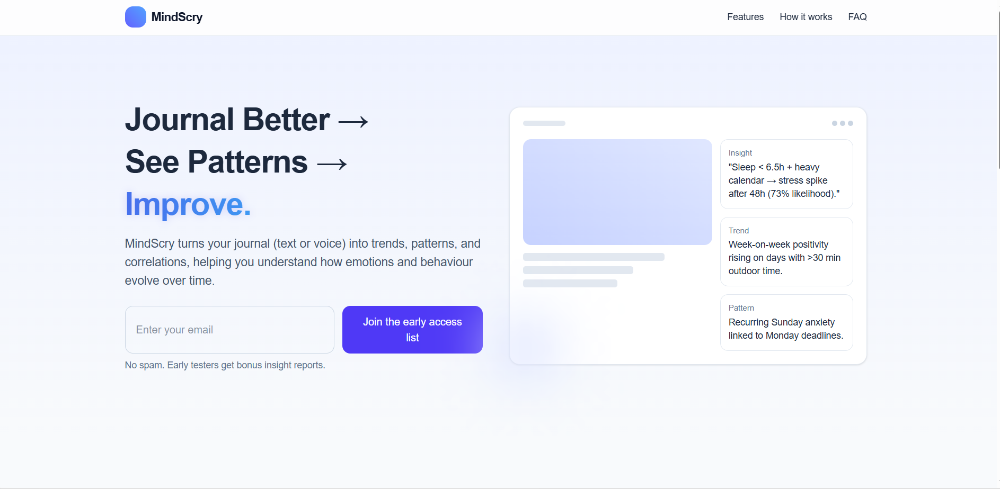

# MindScry

MindScry is an AI journaling product that turns text or voice reflections into trends, patterns, and correlations — helping people understand how their emotions and behaviour evolve over time.

Live site: [mindscry.vercel.app](https://mindscry.vercel.app/)

## What it does

MindScry helps users turn reflection into something more actionable.

Instead of treating journaling as a static archive, MindScry surfaces:
- emotional trends over time
- recurring behavioural patterns
- correlations between journaling and lifestyle data
- predictive signals that may point to stress spikes, motivation dips, or meaningful habit shifts

The goal is simple: help people see themselves more clearly.

## Why MindScry exists

Most journaling tools help users write. Very few help them learn from what they’ve written.

MindScry is built around the idea that reflection becomes much more valuable when it can reveal patterns, not just store memories. That makes journaling more useful for self-awareness, behaviour change, and long-term personal insight.

## Core features

- Trend-based insight generation
- Automatic detection of recurring themes and patterns
- Support for text or voice journaling
- Optional cross-data correlation with sleep, calendar, and habits
- Predictive tendency analysis
- Privacy-first product direction
- Early access signup for founding testers

## Example insights

- Sleep < 6.5h + heavy calendar → stress spike after 48h.
- Week-on-week positivity rising on days with >30 min outdoor time.
- Recurring Sunday anxiety linked to Monday deadlines.

## How it works

1. Capture  
   Write or speak journal entries in a guided flow.

2. Analyse  
   Models extract emotion, themes, and behavioural signals over time.

3. Act  
   MindScry turns those signals into trendlines, correlations, and simple suggestions grounded in the user’s own data.

## Early access

MindScry uses a Formspree-powered signup form to collect early tester interest and feedback without requiring a backend.

The form asks for:
- email
- why they want MindScry
- journaling frequency
- feature interest

That helps shape the product with real user signal, not just assumptions.

## Tech stack

- React
- Vite
- Tailwind CSS
- JavaScript
- Formspree for early access capture

## Status

MindScry is in early access and actively evolving.

The current landing page is used to communicate the product vision, collect interest from early testers, and shape the next version of the product based on feedback.

## Privacy

MindScry is being designed with privacy in mind. The longer-term roadmap includes a local-first approach and end-to-end encryption.

## Screenshots

## Contact

Built with care · Early access 2025
